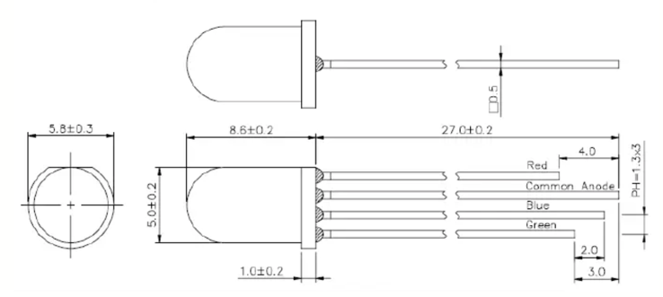

# Buzzer Control
Ce projet contiendra, à terme, tous les fichiers nécessaires à la création et opération des buzzers.
Seront ajoutés les fichiers de fabrication des circuits imprimés, le BOM avec les liens des ressources nécessaires à acheter, l'iso du reaspberry pi, les fichiers 3D et de découpe...

## Choix technique et limitations
Le protocole MQTT a été demandé par le potentiel client initial.
On n'a pas besoin de beaucoup de ressources pour ce projet, donc on a choisi d'utiliser un Raspberry Pi Zero W pour centraliser les buzzers.

Afin de facilement connecter les buzzers au boitier central, on a choisi d'utiliser des câbles RJ45. Du fait du câblage interne, il y a un maximum de 5 buzzers.

Pour facilement identifier le raspberry pi sur le réseau, on affiche son IP sur un écran LCD incorporé au boitier.

### Montage & Cablage
#### Buzzer
Le bouton-buzzer doit être modifié pour y mettre la LED RGB : Une patte en plastique (blanche) doit être coupéee pour passer les câbles. Il faut aussi couper une partie du support pour la même raison.
La LED RGB a 4 pattes. La plus longue est l'anode communes, puis les trois autres pattes pour, de la plus grande à la plus petite, Bleu, Vert, et Rouge.

Il faut étendre ces pattes en y soudant des câbles mous, les faire passer à travers le support, jusqu'à la board RJ45 du buzzer. 

De même, il faut brancher les deux pins du bouton à la board RJ45.

#### Raspberry Pi
Un circuit imprimé a été créé pour simplifier les câblages. Il suffit d'y souder les headers et de connecter aux headers 8 pins les boards RJ45 et au header 4 pin l'écran LCD.

## MQTT protocol
On a choisi d'utiliser des topics MQTT dédiés :
- buzzer/control
- buzzer/config

### buzzer/config
Ce topic est utilisé pour configurer ces valeurs globales :
 - "blocked_color", la couleur des buzzers bloqués, au format d'un tableau représentant les valeurs RVB (entre 0 et 255) [R, V, B] (Par exemple [255, 255, 0] pour du jaune)
 - "valid_color", la couleur du buzzer ayant la main, au format d'un tableau représentant les valeurs RVB (entre 0 et 255) [R, V, B] (Par exemple [0, 255, 0] pour du vert)

### buzzer/control
Ce topic est utilisé pour controler les buzzers en live :
 - "release" : sert à déverrouiller un/des buzzer•s, "" pour tous, sous forme de tableau pour 1 à plusieurs : [1, 2, ...]. En utilisant la numérotation "humaine", 1 à 5.
 - "lock" : Bloque "définitivement" (jusqu'à la sortie de "prison") le•s buzzer•s, sous forme de tableau aussi.
 - "unlock" : Débloque le•s buzzer•s listé•s dans le tableau passé.

## Prochaine version
On peut envisager une version 2 avec plus de buzzers connectables. Avec des 74HC595 (pour les leds) et des 74HC165 (pour les boutons).

### Installation de l'OS
On essaie de créer une image avec tout installé et configuré pour faciliter la mise en place. C'est pas encore fait.
